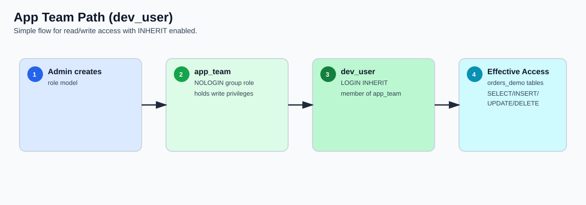
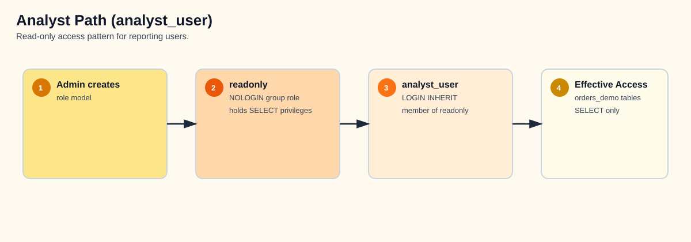
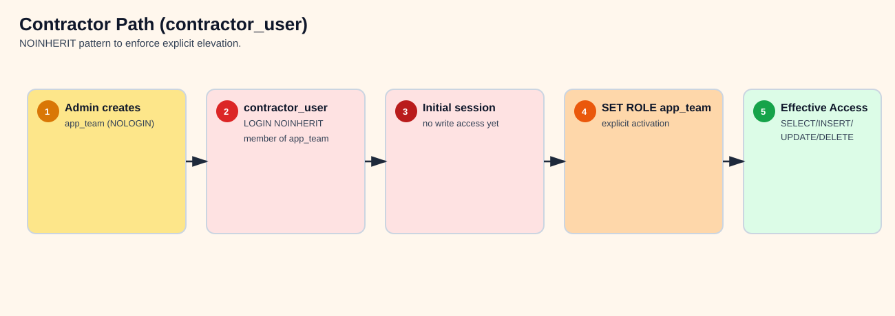
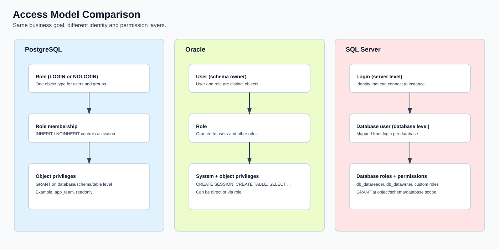
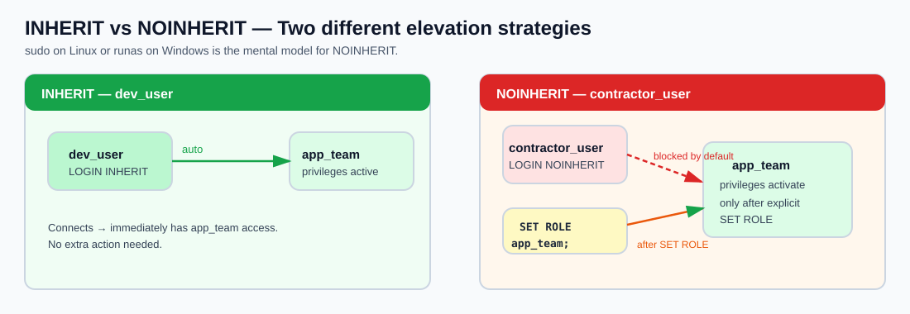

In this section you will learn how PostgreSQL manages access control through its **role** system — creating roles, granting privileges, understanding inheritance, and applying least-privilege principles.

> **Prerequisite:** You should have the `orders_demo` database restored from the **Explore PostgreSQL & Run Demo Workload** section.

---

### Lab Overview

To make this easier to digest, the access model is split into three short diagrams.

#### 1) app_team path (dev_user)



*Footnote - value by step:*
1. Establishes a controlled admin starting point for governance.
2. Centralizes write permissions in one reusable group role.
3. Connects a real user to the role with automatic inheritance.
4. Delivers immediate app productivity without manual role switching.

#### 2) analyst_user path (readonly)



*Footnote - value by step:*
1. Keeps role creation in a single trusted admin workflow.
2. Encapsulates reporting permissions as SELECT-only.
3. Grants analysts safe default access through inheritance.
4. Prevents accidental writes while enabling BI/reporting use cases.

#### 3) contractor_user path (NOINHERIT)



*Footnote - value by step:*
1. Defines a privileged role, but does not expose it by default.
2. Associates contractor identity with explicit guardrails (`NOINHERIT`).
3. Starts each session in low-privilege mode to reduce blast radius.
4. Requires intentional elevation (`SET ROLE`) for controlled operations.
5. Enables temporary write capability with full operator intent.

---

### Understanding Roles in PostgreSQL

PostgreSQL has a single concept for managing access: the **role**. There are no separate "users" and "groups" — everything is a role. The `CREATE USER` and `CREATE GROUP` commands are just convenience aliases:

| Command | What it actually does |
|---|---|
| `CREATE ROLE app_role;` | Creates a role that **cannot login** by default |
| `CREATE USER app_user;` | Same as `CREATE ROLE app_user LOGIN;` — adds login capability |
| `CREATE GROUP app_group;` | Same as `CREATE ROLE app_group;` — deprecated alias |

This is fundamentally different from Oracle (where users and roles are distinct objects) and SQL Server (where logins, users, and roles are separate layers).



Quick comparison for customers:
- PostgreSQL: one role object type; `LOGIN` and `NOLOGIN` define behavior; membership + INHERIT control access.
- Oracle: users and roles are separate objects; privileges can be direct or via role.
- SQL Server: login is server-level, user is database-level, roles are assigned per database.

---

### Azure Flexible Server Role Hierarchy

On Azure Database for PostgreSQL Flexible Server, the admin user you created during deployment is **not** a superuser. Instead, it is a member of the `azure_pg_admin` role, which has most — but not all — superuser privileges.

Connect to the server from the jumpbox:

```sh
psql -h <postgresql-fqdn> -U <pgadmin> -d orders_demo
```

View the existing roles:

```psql
\du
```

You will see something like:

```
                                       List of roles
    Role name     |                         Attributes                         | Member of
------------------+------------------------------------------------------------+------------------
 azure_pg_admin   | Create role, Create DB, Bypass RLS, Replication            | {}
 <your-admin>     | Create role, Create DB                                     | {azure_pg_admin}
 azuresu          | Superuser, Create role, Create DB, Replication, Bypass RLS | {}
```

Key points:
- **`azuresu`** — the true superuser, managed by Azure. You cannot use this role.
- **`azure_pg_admin`** — the highest role available to you. Your admin user is a member of this role.
- **`<your-admin>`** — your admin user. It can create roles, create databases, and grant privileges, but it cannot load extensions that require superuser or access the file system.

---

### Step 1 — Create Application Roles

A good practice is to create a **group role** (cannot login) that holds privileges, then add **login roles** (users) as members.

```sql
-- Create a group role for the application team
CREATE ROLE app_team NOLOGIN;

-- Create a read-only role
CREATE ROLE readonly NOLOGIN;
```

Now create two users and assign them to roles:

```sql
-- Developer: inherits app_team privileges automatically
CREATE ROLE dev_user LOGIN PASSWORD 'Workshop#Dev1' IN ROLE app_team INHERIT;

-- Analyst: inherits readonly privileges automatically
CREATE ROLE analyst_user LOGIN PASSWORD 'Workshop#Read1' IN ROLE readonly INHERIT;

-- Contractor: member of app_team but does NOT inherit privileges automatically
CREATE ROLE contractor_user LOGIN PASSWORD 'Workshop#Ext1' IN ROLE app_team NOINHERIT CONNECTION LIMIT 2;
```

Verify the roles:

```psql
\du
```

```
    Role name        |                 Attributes                      | Member of
---------------------+-------------------------------------------------+------------------
 analyst_user        |                                                 | {readonly}
 app_team            | Cannot login                                    | {}
 contractor_user     | No inheritance, 2 connections                   | {app_team}
 dev_user            |                                                 | {app_team}
 readonly            | Cannot login                                    | {}
```

---

### Step 2 — Grant Privileges on the orders_demo Database

You should already be connected to the `orders_demo` database. If not:

```psql
\c orders_demo
```

Grant privileges to each group role:

```sql
-- app_team gets full access to all tables and sequences in public
GRANT USAGE ON SCHEMA public TO app_team;
GRANT ALL ON ALL TABLES IN SCHEMA public TO app_team;
GRANT ALL ON ALL SEQUENCES IN SCHEMA public TO app_team;

-- readonly gets SELECT only
GRANT USAGE ON SCHEMA public TO readonly;
GRANT SELECT ON ALL TABLES IN SCHEMA public TO readonly;
```

> **Why GRANT USAGE ON SCHEMA?** In PostgreSQL, even if you have table-level privileges, you also need `USAGE` on the schema that contains the table. This is a common gotcha for people coming from Oracle or SQL Server where schema access works differently.

---

### Step 3 — Test INHERIT vs NOINHERIT

This is the most important concept in this section. Use `SET ROLE` to impersonate each user and see the difference.

First, grant yourself the ability to switch to these roles:

```sql
-- Run as your admin user
GRANT dev_user TO <your-admin>;
GRANT analyst_user TO <your-admin>;
GRANT contractor_user TO <your-admin>;
```

#### Test `dev_user` (INHERIT):

```sql
SET ROLE dev_user;

-- This should work — dev_user inherits app_team privileges
SELECT customer_id, first_name, last_name, email FROM customers LIMIT 5;

-- This should also work — app_team has ALL privileges
INSERT INTO customers (first_name, last_name, email, city, country)
VALUES ('Test', 'User', 'test@workshop.dev', 'London', 'United Kingdom');

-- Switch back
RESET ROLE;
```

#### Test `analyst_user` (INHERIT, readonly):

```sql
SET ROLE analyst_user;

-- SELECT works — analyst_user inherits readonly privileges
SELECT status, COUNT(*) FROM orders GROUP BY status;

-- INSERT fails — readonly only has SELECT
INSERT INTO customers (first_name, last_name, email, city, country)
VALUES ('Bad', 'Insert', 'nope@fail.dev', 'London', 'United Kingdom');
-- ERROR: permission denied for table customers

RESET ROLE;
```

#### Test `contractor_user` (NOINHERIT):

```sql
SET ROLE contractor_user;

-- This FAILS — contractor_user does NOT inherit app_team privileges
SELECT * FROM customers LIMIT 1;
-- ERROR: permission denied for table customers
```

**Why?** `contractor_user` was created with `NOINHERIT`. Even though it is a member of `app_team`, it does not automatically receive `app_team`'s privileges. The user must explicitly activate the role:

```sql
-- Explicitly activate the parent role
SET ROLE app_team;

-- Now it works
SELECT * FROM customers LIMIT 5;

RESET ROLE;
```

**When to use NOINHERIT:** For users who should have access but must consciously "elevate" to use it — similar to `sudo` on Linux or `runas` on Windows. Useful for contractors, automated accounts, or break-glass scenarios.



---

### Step 4 — View and Read Privilege Codes

Run the following to see all granted privileges:

```sql
RESET ROLE;
```

```psql
\dp
```

You will see output like:

```
                                  Access privileges
 Schema |    Name      | Type  |       Access privileges        | ...
--------+--------------+-------+--------------------------------+
 public | customers    | table | <admin>=arwdDxt/<admin>       +|
        |              |       | app_team=arwdDxt/<admin>      +|
        |              |       | readonly=r/<admin>             |
 public | orders       | table | <admin>=arwdDxt/<admin>       +|
        |              |       | app_team=arwdDxt/<admin>      +|
        |              |       | readonly=r/<admin>             |
 public | order_items  | table | <admin>=arwdDxt/<admin>       +|
        |              |       | app_team=arwdDxt/<admin>      +|
        |              |       | readonly=r/<admin>             |
 public | products     | table | <admin>=arwdDxt/<admin>       +|
        |              |       | app_team=arwdDxt/<admin>      +|
        |              |       | readonly=r/<admin>             |
```

**Reading the privilege codes:**

| Code | Privilege | Applies to |
|---|---|---|
| `r` | SELECT (read) | Tables, views |
| `a` | INSERT (append) | Tables |
| `w` | UPDATE (write) | Tables |
| `d` | DELETE | Tables |
| `D` | TRUNCATE | Tables |
| `x` | REFERENCES | Tables (foreign keys) |
| `t` | TRIGGER | Tables |
| `U` | USAGE | Schemas, sequences |
| `C` | CREATE | Schemas, databases |
| `c` | CONNECT | Databases |
| `T` | TEMPORARY | Databases |

The format is `role=privileges/grantor`. So `app_team=arwdDxt/<admin>` means: `app_team` has SELECT, INSERT, UPDATE, DELETE, TRUNCATE, REFERENCES, and TRIGGER on this table, granted by your admin user.

---

### Step 5 — REVOKE Privileges

A realistic scenario: the `orders` table holds financial data and should be read-only for the application team. Remove INSERT/UPDATE/DELETE from `app_team` on `orders`, keeping only SELECT:

```sql
REVOKE INSERT, UPDATE, DELETE ON TABLE orders FROM app_team;
```

Verify:

```sql
SET ROLE dev_user;

-- SELECT still works
SELECT order_id, customer_id, total_amount, status FROM orders LIMIT 5;

-- INSERT now fails — orders is protected
INSERT INTO orders (customer_id, order_date, total_amount, status)
VALUES (1, now(), 99.99, 'pending');
-- ERROR: permission denied for table orders

-- But other tables still allow writes
INSERT INTO customers (first_name, last_name, email, city, country)
VALUES ('Another', 'Test', 'another@workshop.dev', 'Dublin', 'Ireland');

RESET ROLE;
```

Check the privilege codes again:

```psql
\dp orders
```

You should see `app_team=rDxt/<admin>` — the `a`, `w`, and `d` codes are gone.

---

### Step 6 — Default Privileges for Future Tables

The `GRANT ALL ON ALL TABLES` command only affects tables that **already exist**. If you create a new table later, the grants are not applied automatically. This catches many people by surprise.

Fix this with `ALTER DEFAULT PRIVILEGES`:

```sql
-- Any future table created by your admin in the public schema
-- will automatically grant SELECT to readonly and ALL to app_team
ALTER DEFAULT PRIVILEGES IN SCHEMA public
  GRANT SELECT ON TABLES TO readonly;

ALTER DEFAULT PRIVILEGES IN SCHEMA public
  GRANT ALL ON TABLES TO app_team;
```

Test it:

```sql
-- Create a new table
CREATE TABLE test_defaults (id serial, name text);

-- Check privileges — readonly and app_team should already have access
```

```psql
\dp test_defaults
```

You should see `readonly=r/<admin>` and `app_team=arwdDxt/<admin>` without any explicit GRANT.

Clean up:

```sql
DROP TABLE test_defaults;
```

---

### Step 7 — Schema-Level Isolation

For a more realistic setup, create a separate schema for the application and restrict the `public` schema:

```sql
-- Create an application schema
CREATE SCHEMA app AUTHORIZATION app_team;

-- Revoke default public access (PostgreSQL grants USAGE + CREATE on public to everyone by default)
REVOKE CREATE ON SCHEMA public FROM PUBLIC;
```

> **About the `PUBLIC` keyword:** In PostgreSQL, `PUBLIC` (all-caps in GRANT/REVOKE context) means "every role." By default, every role has `USAGE` and `CREATE` on the `public` schema — this is a well-known security concern. Revoking `CREATE` from `PUBLIC` is a recommended hardening step.

---

### Step 8 — Verify Permissions Work End-to-End

Open a **new** psql session as `dev_user` to verify everything works without `SET ROLE`:

```sh
# On the jumpbox, open a new connection
psql -h <postgresql-fqdn> -U dev_user -d orders_demo
```

```sql
-- Should work (inherited from app_team)
SELECT COUNT(*) FROM customers;

-- Should fail (we revoked INSERT on orders from app_team in Step 5)
INSERT INTO orders (customer_id, order_date, total_amount, status)
VALUES (1, now(), 49.99, 'pending');
-- ERROR: permission denied for table orders

-- Disconnect
```psql
\q
```

---

### Step 9 — Clean Up Roles

Switch back to your admin user and clean up:

```sh
psql -h <postgresql-fqdn> -U <pgadmin> -d orders_demo
```

```sql
-- Revoke privileges first (required before dropping roles)
REVOKE ALL ON ALL TABLES IN SCHEMA public FROM app_team;
REVOKE ALL ON ALL TABLES IN SCHEMA public FROM readonly;
REVOKE ALL ON ALL SEQUENCES IN SCHEMA public FROM app_team;
REVOKE USAGE ON SCHEMA public FROM app_team;
REVOKE USAGE ON SCHEMA public FROM readonly;

-- Re-grant CREATE on public schema (we revoked it in Step 7)
GRANT CREATE ON SCHEMA public TO PUBLIC;

-- Remove default privilege changes from Step 6
ALTER DEFAULT PRIVILEGES IN SCHEMA public
  REVOKE SELECT ON TABLES FROM readonly;
ALTER DEFAULT PRIVILEGES IN SCHEMA public
  REVOKE ALL ON TABLES FROM app_team;

-- Re-grant INSERT/UPDATE/DELETE on orders (we revoked in Step 5)
-- Not strictly needed since we're dropping the roles, but good practice
GRANT ALL ON ALL TABLES IN SCHEMA public TO <your-admin>;

-- Drop the schema we created
DROP SCHEMA IF EXISTS app;

-- Drop users first, then group roles
DROP ROLE IF EXISTS dev_user;
DROP ROLE IF EXISTS analyst_user;
DROP ROLE IF EXISTS contractor_user;
DROP ROLE IF EXISTS app_team;
DROP ROLE IF EXISTS readonly;

-- Remove the test rows we inserted during the lab
DELETE FROM customers WHERE email IN ('test@workshop.dev', 'another@workshop.dev');
```

---

### Summary

| Concept | What you learned |
|---|---|
| **Roles** | PostgreSQL has one concept: roles. `CREATE USER` = `CREATE ROLE ... LOGIN`. No separate users/groups. |
| **INHERIT vs NOINHERIT** | `INHERIT` = automatic privilege access. `NOINHERIT` = must explicitly `SET ROLE` to activate. |
| **Privilege codes** | `r`=SELECT, `a`=INSERT, `w`=UPDATE, `d`=DELETE, `D`=TRUNCATE, `x`=REFERENCES, `t`=TRIGGER |
| **GRANT / REVOKE** | Grant to group roles, not individual users. Revoke to remove specific privileges. |
| **Default privileges** | `ALTER DEFAULT PRIVILEGES` ensures future tables get the right grants automatically. |
| **Schema isolation** | Revoke `CREATE` on `public` from `PUBLIC`. Use dedicated schemas per application. |
| **Azure specifics** | Your admin is not a superuser — it's a member of `azure_pg_admin`. `azuresu` is Azure-managed. |
