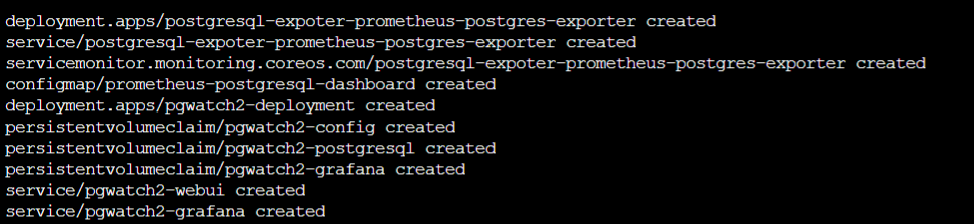

There are several ways to monitor PostgreSQL Server. In this workshop we will study on both monitoring Azure Flexible PostgreSQL Server with opensource tools such as prometheus, grafana and also integrate opensource tools with Azure Monitor.

Sometimes kubernetes clusters can be used to as a monitoring solution. In this section we will install Azure Kubernetes Services (AKS) and install prometheus and grafana to monitor Azure PostgreSQL Server solutions from the easy way.

#### AKS Installation

Before the installation, have the resource group that we've created in the previous sections.
The resource group name was created using the following command unless you changed the name:

```sh
az group create -l Eastus -n PG-Workshop
```
Resource group name **PG-Workshop**


On the  CloudShell run the following

In this step we will deploy additional resources in the resource group that we created in the previous sections


```sh 
rm bicep.zip
```

Download the bicep templates for the workshop

```sh
wget https://pg.azure-workshops.cloud/scripts/bicep.zip
```

Uncompress the the downloaded file

```sh
unzip bicep
```
Use bicep to deploy or update your environment

```
az deployment group create --resource-group PG-Workshop --template-file bicep/main.bicep
```

```sh
export SUBSCRIPTION_ID=$(az account show --query id --output tsv)
export RESOURCE_GROUP="<YourResourceGroup>" 
wget https://pg.azure-workshops.cloud/scripts/02-aks-create.sh
chmod +x 02-aks-create.sh
./02-aks-create.sh
```
If you found AAD propagation taking more than 5 minutes, cancel by pressing CTRL+C.


and run again
```sh
./02-aks-create.sh
```




```sh
kubectl get svc -n monitoring
```
#### Expected output
```
alertmanager-operated                             ClusterIP   None            <none>        9093/TCP,9094/TCP,9094/UDP   26d
prometheus-grafana                                ClusterIP   10.41.33.228    x.x.x.x       30080:30757/TCP              26d
prometheus-kube-prometheus-alertmanager           ClusterIP   10.41.23.115    <none>        9093/TCP                     26d
prometheus-kube-prometheus-operator               ClusterIP   10.41.55.172    <none>        443/TCP                      26d
prometheus-kube-prometheus-prometheus             ClusterIP   10.41.125.188   <none>        9090/TCP                     26d
prometheus-kube-state-metrics                     ClusterIP   10.41.102.217   <none>        8080/TCP                     26d
prometheus-operated                               ClusterIP   None            <none>        9090/TCP                     26d
prometheus-prometheus-node-exporter               ClusterIP   10.41.235.18    <none>        9100/TCP                     26d
```
Copy the IP address that you found on the line **prometheus-grafana** 4th column.

#### Grafana Dashboard (Optional)
Open grafana make sure it is up and running using username: **admin** and password **prom-operator**


#### Configure pgwatch2

Get kubernetes running services

```sh
kubectl get svc
```

The output should be similar to the following, copy the external IP of the **pgwatch2-webui** and the **port**

```
diaa@Azure:~/foo$ kubectl get svc
NAME               TYPE           CLUSTER-IP    EXTERNAL-IP      PORT(S)          AGE
kubernetes         ClusterIP      10.0.0.1      <none>           443/TCP          24m
pgwatch2-grafana   LoadBalancer   10.0.121.14   20.121.149.26    3000:32162/TCP   9m55s
pgwatch2-webui     LoadBalancer   10.0.43.177 **20.121.151.255** **8080**:31360/TCP   9m55s
```
Open browser and access your external IP and the port in this case the url is **20.121.151.255:8080**.


```note
For simplicity we should disable the SSL requirement on the server parameters - please go to server parameters and disable SSL.
```


Return back to the resource groups and go to the private.postgres.database.azure.com


Copy the private IP and keep it as it will be used to in configuring the pgwatch2


Now we return back to configuration page of the pgwatch2

we need to fill the following

* **Unique name** Type a unique name of your choice 
* **DB host** The hostname or the IP address that we got from the previous steps
* **DB user** The PostgreSQL username for your installation
* **DB password** The PostgreSQL password for your installation
* **Preset metrics config** Select Azure

Then press **New** It should list the databases.

Return back to the cloudshell and run:


```sh
kubectl get svc
```

Use the external IP and port of the **pgwatch2-grafana**


Go to the web and use the url from the previous step, you will see the metrics coming in 3 minutes.


