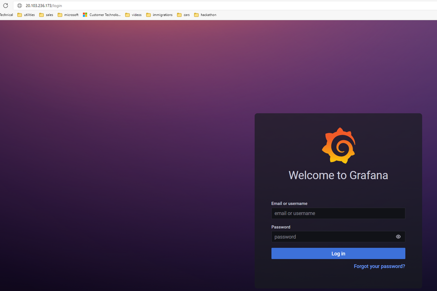

There are several ways to monitor PostgreSQL Server. In this workshop we will study on both monitoring Azure Flexible PostgreSQL Server with opensource tools such as prometheus, grafana and also integrate opensource tools with Azure Monitor.

Sometimes kubernetes clusters can be used to as a monitoring solution. In this section we will install Azure Kubernetes Services (AKS) and install prometheus and grafana to monitor Azure PostgreSQL Server solutions.

#### AKS Installation
From Cloud Shell
```bash
az group create --name aks-rg --location westeurope
az aks create --resource-group aks-rg --name monitoring-cluster --node-count 3 --enable-addons monitoring --generate-ssh-keys
az aks get-credentials --resource-group aks-rg --name monitoring-cluster
kubectl get pods -A
```

Expected output
```
kube-system         coredns-845757d86-bzckm                                           1/1     Running     0          30d
kube-system         coredns-845757d86-ptpdh                                           1/1     Running     0          30d
kube-system         coredns-autoscaler-5f85dc856b-qmndn                               1/1     Running     0          30d
kube-system         csi-azuredisk-node-f9fgk                                          3/3     Running     0          30d
kube-system         csi-azuredisk-node-jm68z                                          3/3     Running     0          7d9h
kube-system         csi-azuredisk-node-jr9wk                                          3/3     Running     0          30d
kube-system         csi-azuredisk-node-prrjq                                          3/3     Running     0          30d
kube-system         csi-azuredisk-node-z852w                                          3/3     Running     0          12d
kube-system         csi-azurefile-node-28zgj                                          3/3     Running     0          6d5h
kube-system         csi-azurefile-node-85dx5                                          3/3     Running     0          6d5h
kube-system         csi-azurefile-node-c7hdr                                          3/3     Running     0          6d5h
kube-system         csi-azurefile-node-g58h9                                          3/3     Running     0          6d5h
kube-system         csi-azurefile-node-grf9f                                          3/3     Running     0          6d5h
kube-system         konnectivity-agent-54845cbbcb-kvvdl                               1/1     Running     0          30d
kube-system         konnectivity-agent-54845cbbcb-qxlf7                               1/1     Running     0          30d
kube-system         kube-proxy-5rqkx                                                  1/1     Running     0          6d5h
kube-system         kube-proxy-8c28d                                                  1/1     Running     0          6d5h
kube-system         kube-proxy-95lpg                                                  1/1     Running     0          6d5h
kube-system         kube-proxy-jj27p                                                  1/1     Running     0          6d5h
kube-system         kube-proxy-xcfn5                                                  1/1     Running     0          6d5h
kube-system         metrics-server-774f99dbf4-sl755                                   1/1     Running     0          6d5h
```

To Install prometheus and its related components we need to install helm client to our local machines. Cloud Shell contains helm client tool.

#### optinal script to install helm client tool
```bash
curl -fsSL -o get_helm.sh https://raw.githubusercontent.com/helm/helm/main/scripts/get-helm-3
chmod 700 get_helm.sh
./get_helm.sh
```

For centralized monitoring solution we should install prometheus operator in our AKS cluster
```bash
helm repo add prometheus-community https://prometheus-community.github.io/helm-charts
helm repo update
kubectl create ns monitoring
helm install prometheus prometheus-community/kube-prometheus-stack --namespace monitoring --set grafana.service.type=LoadBalancer
```


```bash
kubectl get pods -n monitoring
```
#### Expected output
```
prometheus-grafana-6c75b6644-wfhhd                                3/3     Running   0          21d
prometheus-kube-prometheus-operator-6cd54566dc-s4x82              1/1     Running   0          26d
prometheus-kube-state-metrics-66c645dc8c-fzr46                    1/1     Running   0          26d
prometheus-prometheus-kube-prometheus-prometheus-0                2/2     Running   0          25d
prometheus-prometheus-node-exporter-8vzhn                         1/1     Running   0          26d
prometheus-prometheus-node-exporter-8zkdz                         1/1     Running   0          12d
prometheus-prometheus-node-exporter-dp4qr                         1/1     Running   0          7d9h
prometheus-prometheus-node-exporter-ftd8n                         1/1     Running   0          26d
prometheus-prometheus-node-exporter-zj4lj                         1/1     Running   0          26d
```
```bash
kubectl get svc -n monitoring
```
#### Expected output
```
alertmanager-operated                             ClusterIP   None            <none>        9093/TCP,9094/TCP,9094/UDP   26d
prometheus-grafana                                ClusterIP   10.41.33.228    x.x.x.x       30080:30757/TCP              26d
prometheus-kube-prometheus-alertmanager           ClusterIP   10.41.23.115    <none>        9093/TCP                     26d
prometheus-kube-prometheus-operator               ClusterIP   10.41.55.172    <none>        443/TCP                      26d
prometheus-kube-prometheus-prometheus             ClusterIP   10.41.125.188   <none>        9090/TCP                     26d
prometheus-kube-state-metrics                     ClusterIP   10.41.102.217   <none>        8080/TCP                     26d
prometheus-operated                               ClusterIP   None            <none>        9090/TCP                     26d
prometheus-prometheus-node-exporter               ClusterIP   10.41.235.18    <none>        9100/TCP                     26d
```
Type the x.x.x.x ip address to your favorite browser at the line prometheus-grafana. This ip address is the public interface of grafana service which we are going to look the dashboards. 


We need prometheus exporter to collect our metrics. To install prometheus expoter to your kubernetes installation use prometheus-postgresql-expoter.yaml in the code folder. Please replace the variables in the yaml file
```yaml
        env:
        - name: DATA_SOURCE_URI
          value: #POSTGRESQL_SERVER_URI#:5432/postgres?sslmode=disable
        - name: DATA_SOURCE_USER
          value: #USER_NAME#
        - name: DATA_SOURCE_PASS
          value: #PASSWORD#
```

deploy it to kubernetes cluster
```
kubectl apply -f prometheus-postgresql-expoter.yaml -n monitoring
```

#### check logs for any error
#### Expected output
```
ts=2022-02-28T22:47:40.528Z caller=main.go:135 level=info msg="Listening on address" address=:9187
ts=2022-02-28T22:47:40.529Z caller=tls_config.go:195 level=info msg="TLS is disabled." http2=false

```
Create Service Object and ServiceMonitor object for Prometheus Exporter
```
kubectl apply -f prometheus-postgresql-exporter-svc.yaml -n monitoring
kubectl apply -f prometheus-postgresql-expoter-svc-monitor.yaml -n monitoring
``

Add pre configured grafana dashboard for postgresql to your prometheus stack 
```bash
kubectl apply -f grafana-postgresql-dashboard.yaml -n monitoring
```
#### Grafana Dashboard
Open grafana from browser and search for postgresql dashboard for postgresql


