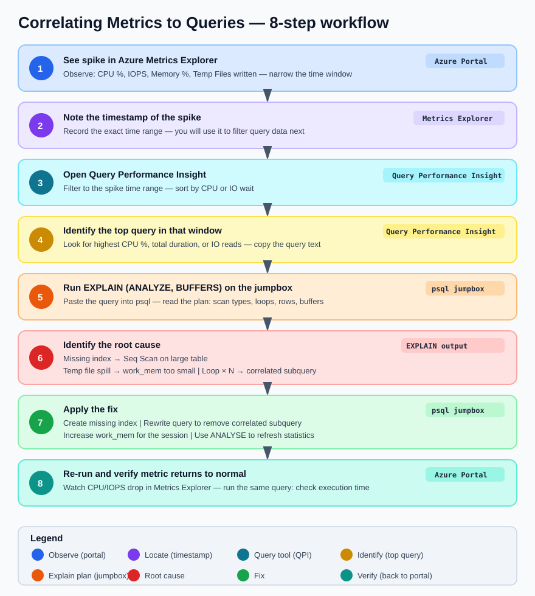

---

sectionid: azure-monitoring
sectionclass: h2
parent-id: day2
title: Monitoring PostgreSQL with Azure Portal
---

In the previous section you ran six heavy queries against the `orders_demo` database and generated concurrent load. Now you will use the Azure Portal to see **exactly what those queries did** to your server — CPU spikes, memory pressure, IOPS saturation, temp file spills, and long-running sessions.

By the end of this section you will be able to:
- Navigate the built-in metrics for Azure Database for PostgreSQL Flexible Server
- Correlate a metric spike to a specific query or behaviour
- Use Query Performance Insight to find the most expensive queries
- Configure an alert rule so you get notified before problems escalate
- Use diagnostic settings to send logs to Log Analytics for deeper analysis

> **Prerequisite:** You should have run the demo workload from the **Explore PostgreSQL & Run Demo Workload** section. The metrics and query stats shown here are generated by that workload. If you skipped it, go back and run at least Queries 1, 3, and 5 concurrently before continuing.

---

### Step 1 — Open the Metrics Blade

1. Go to the **Azure Portal** → your resource group → click your **PostgreSQL Flexible Server**
2. In the left menu, under **Monitoring**, click **Metrics**

You will see a chart area with a dropdown to select metrics. This is **Azure Monitor Metrics Explorer** — it works the same way for all Azure resources, but the available metrics are specific to PostgreSQL.

---

### Step 2 — Observe CPU Impact

#### 2.1 — Add the CPU metric

1. Click **Add metric**
2. Metric namespace: *leave default*
3. Metric: **CPU percent**
4. Aggregation: **Max**
5. Set the time range to **Last 1 hour** (top-right)

<!-- screenshot: cpu-percent-spike.png -->

**What to look for:** You should see a clear spike corresponding to when you ran the concurrent workload (Queries 1, 3, and 5). If you ran Query 5 with a loop count of 50 or 100, you will see a sustained plateau at high CPU for the duration.

**Link to the workload:**

| Query | Why it caused CPU | What you see in the chart |
|---|---|---|
| Query 1 (cross-join aggregation) | Hash joins across 4 tables, COUNT(DISTINCT) forcing sort-based dedup | Sharp spike at start |
| Query 3 (window functions) | Three window functions each requiring a full sort of 100K rows | Overlapping spike with Query 1 |
| Query 5 (loop × 20–100) | Sustained sequential scans and md5() computation in a tight loop | Flat plateau at high CPU |

#### 2.2 — Split by dimension (optional)

Click **Apply splitting** → split by **None** (Flexible Server doesn't split CPU by backend, but this is useful for other metrics like connections).

> **Tip:** Click the **pin icon** to pin this chart to a dashboard. When running workshops or demos, having a pre-built dashboard saves time.

---

### Step 3 — Observe Memory Pressure

1. Click **Add metric** (or start a new chart)
2. Metric: **Memory percent**
3. Aggregation: **Max**

**What to look for:** Memory spikes correlate with:
- **Query 3 (window functions):** PostgreSQL materialises sort results in memory. If `work_mem` is sufficient, you see a memory spike. If not, it spills to disk (you will see that in Step 5 instead).
- **Query 1 (hash joins):** Each hash join builds an in-memory hash table.

**Healthy range:** < 75%. If you consistently see > 85%, the server SKU may be too small for the workload, or `shared_buffers` / `work_mem` are misconfigured.

---

### Step 4 — Observe IOPS and Storage

Add these metrics to see storage behaviour:

| Metric | Aggregation | What it shows |
|---|---|---|
| **Read IOPS** | Max | Disk reads — high during sequential scans |
| **Write IOPS** | Max | Disk writes — high during sorts that spill, checkpoints |
| **Read Throughput** | Max | Bytes/sec read from storage |
| **Write Throughput** | Max | Bytes/sec written to storage |
| **Storage percent** | Max | How full the disk is |

<!-- screenshot: iops-chart.png -->

**Link to the workload:**

| Query | Expected I/O pattern |
|---|---|
| Query 1 (cross-join) | High **read IOPS** — sequential scan of all 4 tables from disk |
| Query 4 (md5 + string_agg + sort) | High **write IOPS** — sorts spill to temp files |
| Query 5 (loop) | Sustained **read IOPS** — same tables scanned 20–100 times |
| Query 6 (DISTINCT ON + sort) | Spike in **write IOPS** if the sort exceeds `work_mem` |

> **Important:** Azure Flexible Server has IOPS limits based on SKU and storage size. If your queries hit the IOPS ceiling, the server throttles I/O and queries slow down dramatically. You can see this by comparing **Read IOPS** against the provisioned IOPS limit shown in the **Overview** blade.

---

### Step 5 — Observe Temp Files and Connections

These less obvious metrics reveal important performance details:

#### 5.1 — Temp files

1. Metric: **Temp Files Size** (under the PostgreSQL-specific metrics)
2. Aggregation: **Max**

Temp files are created when PostgreSQL runs a sort or hash that exceeds `work_mem`. This is a direct signal that your queries are too heavy for the current `work_mem` setting.

**Link to the workload:**
- **Query 3** (window functions: 3 sorts on 100K rows) — most likely temp file generator
- **Query 4** (sort by computed hash) — random sort order forces spill
- **Query 6** (DISTINCT ON with multi-column sort) — spills if table is larger than `work_mem`

**What to do about it:** Increasing `work_mem` reduces temp file usage but increases memory consumption per-session. The trade-off is:

```
Higher work_mem → fewer temp files → faster sorts → more RAM per connection
Lower work_mem  → more temp files → slower sorts → less RAM per connection
```

For 10 concurrent connections with `work_mem = 64MB`, PostgreSQL may use up to 640MB just for sorts.

#### 5.2 — Active connections

1. Metric: **Active Connections**
2. Aggregation: **Max**

**What to look for:** When you ran 3 concurrent queries in Step 7 of the workload section, you should see active connections jump from 1 to 3 (or more). If connections spike beyond what you expect, it may indicate:
- Connection pooling is not configured (each app request opens a new connection)
- A connection leak (connections are opened but never closed)

---

### Step 6 — Query Performance Insight

This is the most powerful built-in tool for finding slow queries without installing any extensions.

1. In the left menu, under **Intelligent Performance**, click **Query Performance Insight**
2. You will see tabs: **Long running queries**, **Top queries by CPU**, **Top queries by IO**

#### 6.1 — Long running queries

This tab shows queries that took the longest wall-clock time. After the demo workload, you should see:

| Expected query | Why it appears here |
|---|---|
| Query 5 (DO $$ loop) | Ran for 30+ seconds |
| Query 1 (cross-join aggregation) | Multi-table join with aggregation |
| Query 3 (window functions) | Three sorts on 100K rows |

> **Note:** Query Performance Insight normalises queries — it replaces literal values with `$1`, `$2` placeholders so identical queries with different parameters are grouped together. The `DO $$ ... $$` block appears as a single query.

#### 6.2 — Top queries by CPU

Switch to the **CPU** tab. This shows queries ranked by total CPU time consumed.

**Expected top entries after the workload:**

| Rank | Query | Why |
|---|---|---|
| 1 | Query 5 (loop) | md5() computed on 300K rows × 20–100 iterations |
| 2 | Query 1 (cross-join) | Hash joins + COUNT(DISTINCT) + final sort |
| 3 | Query 4 (md5 + string_agg) | md5() on every row + string_agg with internal sort |

#### 6.3 — Top queries by IO

Switch to the **IO** tab. This ranks queries by blocks read from storage.

**Expected top entries:**

| Rank | Query | Why |
|---|---|---|
| 1 | Query 5 (loop) | Sequential scan of orders + order_items × 20–100 times |
| 2 | Query 2 (correlated subquery) | ~20,000 sequential scans of orders |
| 3 | Query 1 (cross-join) | Full scan of all 4 tables |

> **Tip:** Click on any query bar to see the full query text and its execution timeline.

---

### Step 7 — Enable pg_stat_statements (if not already enabled)

Query Performance Insight relies on `pg_stat_statements` under the hood. If it's not enabled:

1. Go to **Server parameters** in the left menu
2. Search for `shared_preload_libraries`
3. Ensure `pg_stat_statements` is checked
4. Search for `pg_stat_statements.track` and set it to `ALL`
5. Click **Save** — this requires a server restart

After the restart, connect from the jumpbox and create the extension:

```sql
CREATE EXTENSION IF NOT EXISTS pg_stat_statements;
```

Verify it's working:

```sql
SELECT calls, total_exec_time, mean_exec_time, rows, LEFT(query, 100) AS query
FROM pg_stat_statements
ORDER BY total_exec_time DESC
LIMIT 10;
```

You should see the demo workload queries at the top of the list.

---

### Step 8 — Configure Diagnostic Settings (Logs to Log Analytics)

While Metrics Explorer shows numbers, **diagnostic settings** capture detailed logs including individual query executions, autovacuum runs, and connection events.

#### 8.1 — Create a Log Analytics workspace (if you don't have one)

```bash
az monitor log-analytics workspace create \
  --resource-group <resource-group> \
  --workspace-name pg-workshop-logs \
  --location uksouth
```

#### 8.2 — Enable diagnostic settings

1. In the PostgreSQL server blade, click **Diagnostic settings** (under Monitoring)
2. Click **+ Add diagnostic setting**
3. Name: `pg-logs`
4. Check the log categories:
   - **PostgreSQL Sessions** — connection/disconnection events
   - **PostgreSQL Query Store Runtime** — query execution statistics
   - **PostgreSQL Query Store Wait Statistics** — what queries waited on
5. Check **AllMetrics**
6. Destination: **Send to Log Analytics workspace** → select `pg-workshop-logs`
7. Click **Save**

> Logs take 5–10 minutes to start appearing in Log Analytics.

#### 8.3 — Query the logs with KQL

Go to your Log Analytics workspace → **Logs**. Try these queries:

**Slow queries (> 5 seconds):**

```kql
AzureDiagnostics
| where ResourceProvider == "MICROSOFT.DBFORPOSTGRESQL"
| where Category == "PostgreSQLQueryStoreRuntimeStatistics"
| where mean_time_s > 5
| project TimeGenerated, db_name_s, query_id_s, calls_d, mean_time_s, total_time_s
| order by total_time_s desc
| take 20
```

**Connection events:**

```kql
AzureDiagnostics
| where ResourceProvider == "MICROSOFT.DBFORPOSTGRESQL"
| where Category == "PostgreSQLSessions"
| project TimeGenerated, event_s, user_s, client_ip_s, db_name_s
| order by TimeGenerated desc
| take 50
```

**Wait events (what are queries waiting on):**

```kql
AzureDiagnostics
| where ResourceProvider == "MICROSOFT.DBFORPOSTGRESQL"
| where Category == "PostgreSQLQueryStoreWaitStatistics"
| summarize total_wait_ms = sum(total_time_s * 1000) by event_s, query_id_s
| order by total_wait_ms desc
| take 20
```

---

### Step 9 — Create an Alert Rule

Set up an alert so you are notified when CPU exceeds a threshold — this simulates a production monitoring setup.

#### 9.1 — Create the alert

1. In the PostgreSQL server blade → **Alerts** (under Monitoring)
2. Click **+ Create** → **Alert rule**
3. Condition:
   - Signal: **CPU percent**
   - Operator: **Greater than**
   - Threshold: **80**
   - Aggregation type: **Maximum**
   - Aggregation granularity: **5 minutes**
   - Frequency of evaluation: **1 minute**
4. Click **Next: Actions**

#### 9.2 — Create an action group

1. Click **+ Create action group**
2. Name: `workshop-alerts`
3. Notification type: **Email/SMS/Push/Voice**
4. Enter your email address
5. Click **Review + create** → **Create**

#### 9.3 — Complete the alert rule

1. Alert rule name: `High CPU Alert`
2. Severity: **2 - Warning**
3. Click **Review + create** → **Create**

#### 9.4 — Test the alert

Go back to the jumpbox and re-run Query 5 with a higher loop count:

```psql
\c orders_demo
```

```sql
DO $$
BEGIN
  FOR i IN 1..100 LOOP
    PERFORM COUNT(*) FROM orders o
    JOIN order_items oi ON oi.order_id = o.order_id
    WHERE md5(o.status || oi.quantity::TEXT) LIKE '00%';
  END LOOP;
END $$;
```

Within a few minutes, you should receive an email alert that CPU exceeded 80%.

> **Clean up:** After testing, you can disable the alert rule to avoid further notifications. Go to **Alerts** → **Alert rules** → click the rule → **Disable**.

---

### Step 10 — Correlating Metrics to Queries (Summary)

This is the key skill — when you see a metric spike in the portal, how do you trace it back to a specific query?



Here is how each demo query maps to the metrics you observed:

| Query | CPU | Memory | Read IOPS | Write IOPS | Temp Files | Root Cause |
|---|---|---|---|---|---|---|
| Q1 — Cross-join aggregation | High | Medium | High | Low | Low | No indexes on FK columns → sequential scans + hash joins |
| Q2 — Correlated subquery | High | Low | Very High | Low | Low | No index on `orders.customer_id` → 20K sequential scans |
| Q3 — Window functions | High | High | Medium | Medium–High | High | Three sorts on 100K rows → memory pressure → temp file spill |
| Q4 — md5 + string_agg | Medium | Medium | High | Medium | Medium | Per-row function evaluation + sort by computed value |
| Q5 — Loop × 20–100 | Very High | Low | Very High | Low | Low | Sustained CPU: same expensive query in tight loop |
| Q6 — DISTINCT ON + sort | Medium | Medium | Medium | Medium | Medium | Full sort of 100K rows → temp file if `work_mem` too low |

---

### Step 11 — Azure Monitor Workbooks (Optional — Instructor Demo)

Azure provides pre-built **Workbooks** for PostgreSQL that combine multiple metrics and logs into a single dashboard.

1. In the PostgreSQL blade → **Workbooks** (under Monitoring)
2. Browse the gallery — look for:
   - **PostgreSQL Flexible Server Overview** — CPU, memory, connections, IOPS in one view
   - **Query Performance** — visualises `pg_stat_statements` data over time
3. Click on a workbook to open it. You can filter by time range and server instance.

> **When to use Workbooks vs. Metrics Explorer:**
> - **Metrics Explorer** — ad-hoc investigation, "what is happening right now"
> - **Workbooks** — pre-built dashboards for ongoing monitoring, good for handoff to ops teams
> - **Query Performance Insight** — developer-focused, "which query is the problem"
> - **Log Analytics (KQL)** — deepest level, cross-correlate logs with metrics, custom alerting

---

### Step 12 — Recommended Server Parameters for Monitoring

Before leaving this section, verify these server parameters are enabled. They control what telemetry PostgreSQL collects:

1. Go to **Server parameters** in the portal
2. Search for and verify each parameter:

| Parameter | Recommended value | Why |
|---|---|---|
| `track_io_timing` | `on` | Enables I/O timing in `pg_stat_activity` and `EXPLAIN (BUFFERS)` |
| `track_activities` | `on` | Required for `pg_stat_activity` to show current queries |
| `track_counts` | `on` | Required for `pg_stat_user_tables` counters (vacuum, scans) |
| `pg_stat_statements.track` | `all` | Track queries in all contexts (top-level + nested) |
| `log_min_duration_statement` | `5000` | Log any query taking > 5 seconds to the PostgreSQL log |
| `log_checkpoints` | `on` | Log checkpoint start/end with timing — helps diagnose I/O spikes |
| `log_connections` | `on` | Log each new connection — helps detect connection storms |
| `log_disconnections` | `on` | Log disconnections with session duration |
| `log_temp_files` | `0` | Log every temp file creation (value is minimum size in KB; 0 = all) |
| `log_autovacuum_min_duration` | `0` | Log every autovacuum run — essential for vacuum monitoring |
| `log_lock_waits` | `on` | Log when a session waits longer than `deadlock_timeout` for a lock |

> **Note:** Changing `shared_preload_libraries` requires a server restart. All other parameters above can be applied dynamically.

<!-- screenshot: server-parameters.png -->

---

### What You Learned

In this section you:

1. **Observed CPU, memory, IOPS, and temp file metrics** in Azure Metrics Explorer and correlated each spike to a specific demo query
2. **Used Query Performance Insight** to identify the top queries by CPU consumption and I/O without needing SSH access to the server
3. **Enabled pg_stat_statements** to collect detailed per-query statistics
4. **Configured diagnostic settings** to send PostgreSQL logs to Log Analytics and wrote KQL queries to analyse them
5. **Created an alert rule** that sends a notification when CPU exceeds a threshold
6. **Learned the triage workflow**: Metric spike → timestamp → Query Performance Insight → EXPLAIN ANALYZE → fix → verify

These skills apply directly to production operations. The demo workload intentionally created the same problems you will see in real applications — missing indexes, sequential scans, temp file spills, and sustained CPU from poorly written queries. The next sections (Database Profiling, MVCC, Statistics & Query Planning) will teach you to diagnose and fix these problems from the PostgreSQL side.
