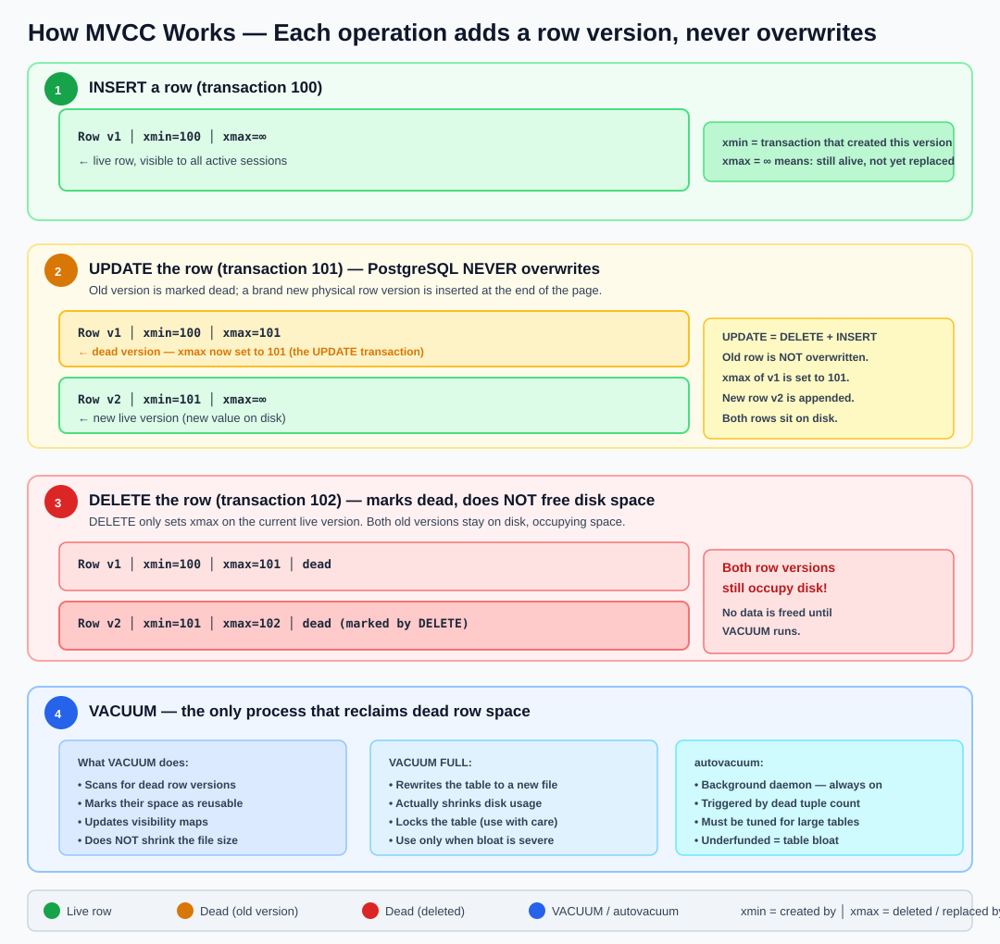

---

sectionid: mvcc
sectionclass: h2
parent-id: day2
title: Multiversion Concurrency Control (MVCC)
hide: false
published: true
---

PostgreSQL never overwrites data in place. When you `UPDATE` a row, it creates a **new version** of that row and marks the old one as "dead." When you `DELETE` a row, it marks the existing version as dead. The dead versions remain on disk until `VACUUM` reclaims the space.

This mechanism is called **MVCC (Multi-Version Concurrency Control)** and it is what allows PostgreSQL to serve reads and writes concurrently without locking.

> **Why this matters:** If you don't understand MVCC, you will be surprised when tables grow far larger than the data they contain, when `DELETE` doesn't free disk space, and when autovacuum becomes critical infrastructure rather than a nice-to-have.

---

### How MVCC Works — A Visual Explanation



> **VACUUM is not optional maintenance — it is core infrastructure.** Unlike Oracle or SQL Server, PostgreSQL never overwrites rows in place. Every `UPDATE` appends a new row version; every `DELETE` just marks the current version as dead. Over time, heavily-updated tables accumulate thousands of dead versions that bloat your storage, slow down sequential scans, and make index maintenance more expensive. `autovacuum` handles this automatically, but it must be tuned for large or fast-changing tables — the defaults are optimised for small databases, not production workloads.

> **Golden rule:** if autovacuum cannot keep up with dead tuple growth, table size will grow unboundedly even if row count stays constant.

**Key fields on every row (system columns):**

| Column | Meaning |
|---|---|
| `xmin` | The transaction ID that **created** this row version |
| `xmax` | The transaction ID that **deleted or replaced** this row version. `0` means it is still live. |
| `ctid` | The physical location of the row on disk (page, offset) |

You can query these directly:

```sql
SELECT ctid, xmin, xmax, customer_id, first_name
FROM customers
LIMIT 5;
```

---

### How This Differs from Oracle and SQL Server

| Aspect | PostgreSQL | Oracle | SQL Server |
|---|---|---|---|
| **UPDATE** | Creates a new row version in the same table | Updates the row in place; old version goes to **undo segment** | Updates the row in place; old version goes to **tempdb** (if snapshot isolation on) |
| **Dead rows** | Stay in the table until VACUUM | Stored in undo; auto-managed by undo retention | Stored in tempdb version store; auto-cleaned |
| **Table bloat** | Yes — table grows if vacuum doesn't keep up | No — undo is separate storage | No — tempdb absorbs versioning |
| **Space reclaim** | `VACUUM` (regular) or `VACUUM FULL` (rewrites table) | Automatic (undo segments recycle) | Automatic |
| **Background process** | **autovacuum** — must be running and tuned | Not needed for space reclaim | Ghost cleanup task |

The fundamental insight: **In PostgreSQL, an UPDATE is essentially a DELETE + INSERT.** This has massive implications for table size, index maintenance, and performance.

---

### Hands-On Lab — Observing MVCC with the orders_demo Database

We will use the `orders_demo` database from the workload section to observe MVCC in action on a realistic dataset.

Connect to the database:

```sh
psql -h <postgresql-fqdn> -U <pgadmin> -d orders_demo
```

Enable timing:

```psql
	iming
```

---

#### Step 1 — Baseline: Measure Table Size and Dead Tuples

```sql
SELECT
  relname,
  pg_size_pretty(pg_relation_size(relid)) AS table_size,
  n_live_tup,
  n_dead_tup,
  last_autovacuum
FROM pg_stat_user_tables
WHERE relname IN ('customers', 'orders', 'order_items')
ORDER BY pg_relation_size(relid) DESC;
```

Record the current sizes. If autovacuum has been running (which it should be), `n_dead_tup` should be low.

---

#### Step 2 — Disable Autovacuum

To clearly observe the effect of dead tuples, temporarily disable autovacuum through the **Azure Portal**:

1. Go to your PostgreSQL Flexible Server → **Server parameters**
2. Search for `autovacuum`
3. Set it to **OFF**
4. Click **Save**

> **Warning:** Never disable autovacuum in production. We are doing this only to demonstrate what happens when dead tuples accumulate.

Verify from psql:

```sql
SHOW autovacuum;
```

Expected: `off`

---

#### Step 3 — Generate Dead Tuples via UPDATE

Let's update all 10,000 customers — adding 10 loyalty points to each:

```sql
UPDATE customers SET loyalty_points = loyalty_points + 10;
```

Now check the impact:

```sql
SELECT
  relname,
  pg_size_pretty(pg_relation_size(relid)) AS table_size,
  n_live_tup,
  n_dead_tup
FROM pg_stat_user_tables
WHERE relname = 'customers';
```

You should see:
- `n_live_tup` ≈ 10,000 (the new row versions)
- `n_dead_tup` ≈ 10,000 (the old row versions — still on disk)
- **Table size has grown** — PostgreSQL had to write 10,000 new rows without reclaiming the old ones

Run the UPDATE again:

```sql
UPDATE customers SET loyalty_points = loyalty_points + 10;
```

Check again:

```sql
SELECT
  relname,
  pg_size_pretty(pg_relation_size(relid)) AS table_size,
  n_live_tup,
  n_dead_tup
FROM pg_stat_user_tables
WHERE relname = 'customers';
```

Now `n_dead_tup` ≈ 20,000 — two rounds of dead rows. The table has grown further even though it still represents the same 10,000 customers.

---

#### Step 4 — See Dead Tuples with System Columns

Query the system columns directly to see multiple versions:

```sql
SELECT ctid, xmin, xmax, customer_id, loyalty_points
FROM customers
WHERE customer_id = 1;
```

You will see only the **live** version (xmax = 0). The dead versions are invisible to normal queries — that's the whole point of MVCC (readers don't see uncommitted or dead rows).

To see how much space dead rows occupy, check the **page count**:

```sql
SELECT
  relpages AS pages_on_disk,
  pg_size_pretty(pg_relation_size('customers')) AS size,
  reltuples::bigint AS estimated_live_rows
FROM pg_class
WHERE relname = 'customers';
```

Compare `relpages` to what it was in Step 1 — it should be significantly larger.

---

#### Step 5 — Observe the Impact of DELETE

Delete half the orders (those with status = 'cancelled' or 'returned'):

```sql
SELECT status, COUNT(*) FROM orders GROUP BY status;

DELETE FROM order_items
WHERE order_id IN (SELECT order_id FROM orders WHERE status IN ('cancelled', 'returned'));

DELETE FROM orders WHERE status IN ('cancelled', 'returned');
```

Check the damage:

```sql
SELECT
  relname,
  pg_size_pretty(pg_relation_size(relid)) AS table_size,
  n_live_tup,
  n_dead_tup,
  ROUND(100.0 * n_dead_tup / NULLIF(n_live_tup + n_dead_tup, 0), 1) AS dead_pct
FROM pg_stat_user_tables
WHERE relname IN ('orders', 'order_items')
ORDER BY relname;
```

The tables still occupy the same disk space (or more) even though rows have been deleted. `dead_pct` may be 20–40%.

---

#### Step 6 — VACUUM (Regular)

Run a regular VACUUM and observe what changes:

```sql
VACUUM VERBOSE customers;
```

What VACUUM does:
1. Scans the table for dead row versions
2. Marks the space they occupy as **reusable** (available for future INSERTs/UPDATEs)
3. Optionally truncates empty pages at the end of the file

```sql
SELECT
  relname,
  pg_size_pretty(pg_relation_size(relid)) AS table_size,
  n_live_tup,
  n_dead_tup
FROM pg_stat_user_tables
WHERE relname = 'customers';
```

After VACUUM:
- `n_dead_tup` → 0
- **Table size may NOT shrink** — regular VACUUM marks space as reusable but doesn't return it to the OS (unless trailing empty pages can be truncated)

This is a critical distinction: **VACUUM reclaims space *within* the table for reuse. It does NOT shrink the file.**

---

#### Step 7 — VACUUM FULL (Table Rewrite)

To actually shrink the file on disk, use `VACUUM FULL`:

```sql
VACUUM FULL VERBOSE customers;
```

```sql
SELECT
  relname,
  pg_size_pretty(pg_relation_size(relid)) AS table_size,
  n_live_tup,
  n_dead_tup
FROM pg_stat_user_tables
WHERE relname = 'customers';
```

Now the table size is back to its minimal size. But `VACUUM FULL`:
- Takes an **ACCESS EXCLUSIVE** lock — no reads or writes during the rewrite
- Rewrites the entire table and all its indexes
- Requires extra disk space equal to the table size (it builds a new copy)

> **Production rule of thumb:** Use regular `VACUUM` (via autovacuum) for day-to-day maintenance. Use `VACUUM FULL` only during maintenance windows when you can tolerate downtime on that table.

Also vacuum the orders tables:

```sql
VACUUM FULL VERBOSE orders;
VACUUM FULL VERBOSE order_items;
```

---

#### Step 8 — Re-enable Autovacuum

Go back to **Azure Portal** → **Server parameters** → set `autovacuum` to **ON** → **Save**.

Verify:

```sql
SHOW autovacuum;
```

Expected: `on`

---

#### Step 9 — Understand Autovacuum Thresholds

Autovacuum triggers based on these parameters:

```sql
SHOW autovacuum_vacuum_threshold;          -- default: 50
SHOW autovacuum_vacuum_scale_factor;       -- default: 0.2
SHOW autovacuum_analyze_threshold;         -- default: 50
SHOW autovacuum_analyze_scale_factor;      -- default: 0.1
```

The formula for when autovacuum runs VACUUM on a table:

```
dead_tuples > autovacuum_vacuum_threshold + (autovacuum_vacuum_scale_factor × n_live_tup)
```

For the `customers` table (10,000 rows):

```
Threshold = 50 + (0.2 × 10,000) = 2,050 dead tuples
```

This means autovacuum will kick in after 2,050 dead tuples accumulate. For smaller tables, the fixed threshold of 50 dominates. For large tables (millions of rows), the 20% scale factor means autovacuum waits too long — a common tuning point in production.

> **Tip:** For high-write tables, lower `autovacuum_vacuum_scale_factor` to `0.05` or even `0.01` at the table level:
> ```sql
> ALTER TABLE orders SET (autovacuum_vacuum_scale_factor = 0.05);
> ```

---

### Summary

| Concept | Key takeaway |
|---|---|
| **UPDATE = DELETE + INSERT** | Old row version stays on disk as a dead tuple |
| **DELETE** | Marks the row as dead; space is NOT freed |
| **VACUUM** | Marks dead tuple space as reusable *within* the table; does NOT shrink the file |
| **VACUUM FULL** | Rewrites the table, reclaims disk space, but takes an exclusive lock |
| **autovacuum** | Background process that runs VACUUM + ANALYZE automatically; **never disable it in production** |
| **Bloat** | If autovacuum can't keep up, tables grow unboundedly — this is the #1 operational issue with PostgreSQL |
| **Oracle/SQL Server difference** | They put old versions in undo/tempdb; PostgreSQL puts them in the table itself |

After completing the VACUUM FULL in the hands-on lab, verify the customers table returned to its original size:

```sql
SELECT pg_size_pretty(pg_relation_size('customers')) AS customers_size;
```